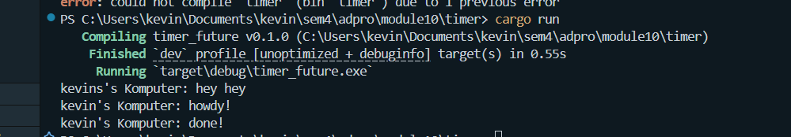
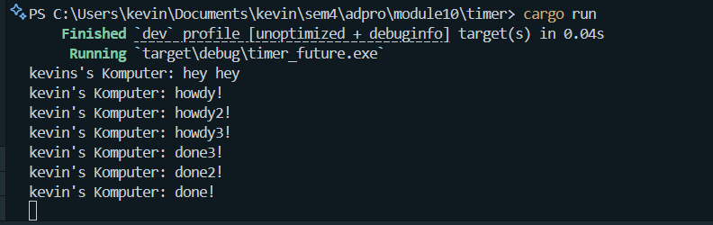
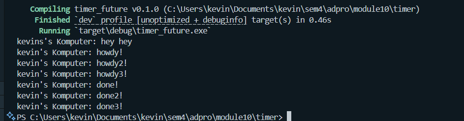
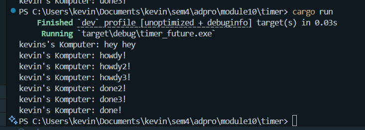

## Understanding How It Works

In this experiment, i added a println! statement immediately after calling spawner.spawn() to better observe execution order. When i ran the program, the output printed "kevins's Komputer: hey hey" first, even though it appeared after the spawn call in the code. This happens because spawn only schedules the task to run asynchronously — it does not block or wait for it to complete. Therefore, the main thread continues immediately to the next line and prints "hey hey" before the async task starts. The actual async task begins later, prints "howdy!", waits for 2 seconds using TimerFuture, and then prints "done!". This shows the asynchronous behavior of Rust futures, where tasks are scheduled and executed independently of the main thread flow.

## Testing Multiple Spawns

remove statement spawner

include statement spawner

When i spawn multiple tasks, each one is queued and later executed by the executor in a cooperative, asynchronous fashion. If drop spawner is called, it signals the executor that no more tasks will be added, so it knows when to stop running. In the first image where drop(spawner) is commented out, some tasks may not finish because the executor doesn't realize it should wait for more tasks and may exit prematurely. However, when drop(spawner) is included , all spawned tasks are guaranteed to complete, and the output shows all "howdy!" and "done!" messages in order. This demonstrates the importance of drop(spawner) in ensuring that the executor terminates only after all spawned tasks have completed. this execution shows how the spawner and drop(spawner) affect task scheduling in our executor.